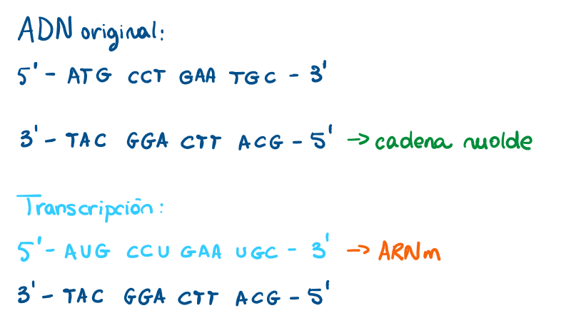

# Práctica 2

En esta práctica recorremos de forma completa y aplicada el **dogma central de la biología molecular**,
es decir, el flujo de la información genética desde el ADN hasta la proteína. A través de distintos ejercicios, 
se abordan las etapas fundamentales: la **replicación** del ADN, la **transcripción** de la cadena molde a ARNm
y la **traducción** del ARNm a una secuencia de aminoácidos. Además, se introducen conceptos complementarios como
el **splicing alternativo**, que explica cómo un mismo gen puede originar diferentes proteínas, y la relación entre secuencia,
estructura y función proteica.

Todo esto además se explora de forma práctica utilizando herramientas de bioinformática como `Biopython` y bases de datos
públicas, como NCBI (_National Library of Medicine_). Así, se conecta la biología molecular con el análisis computacional,
permitiendo visualizar cómo pequeñas variaciones o mutaciones pueden tener un impacto en la funcionalidad de las proteínas y, en última instancia, en los organismos.

## Ejercicio 1 - Replicación del ADN

El objetivo de este ejercicio es comprender el mecanismo semiconservativo y las enzimas implicadas.

Se comienza con la siguiente secuencia de ADN: **5' - ATG CCG TTA GCT - 3' / 3' - TAC GGC AAT CGA 5'**, haciendo primero una
ronda de replicación:

*Figura 1. Proceso de Replicación de ADN*

Como se puede ver en la **Figura 1**, las dos nuevas hebras que se formarán son las resaltadas en naranja, es decir: 3’ - TAC GGC AAT CGA - 5’ (hebra nueva 1) y 5’ - ATG CCG TTA GCT - 3’ (hebra nueva 2).
Tal y como se puede observar, se han creado dos nuevas moléculas de ADN idénticas a la original, de tal forma que cada nueva molécula está
formada por una hebra del ADN original, y una hebra recién sintetizada, lo que demuestra que la replicación es un proceso semiconservativo.

### Función de las enzimas helicasa, primasa, ADN polimerasa y ligasa en este proceso
- **Helicasa:** rompe los puentes de hidrógeno entre las dos hebras originales de ADN.
- **Primasa:** sintetiza pequeños fragmentos de ARN que sirven como cebadores.
- **ADN polimerasa:** inicia la síntesis de nuevas hebras complementarias gracias a los cebadores, en dirección 5' → 3'
- **Ligasa:** une los fragmentos de Okazaki en la hebra rezagada (3' → 5') para generar una hebra continua de ADN.

### ¿Qué ocurriría si la ADN polimerasa cometiera un error en una base y no se corrigiera?

Si la ADN polimerasa cometiera un error en una base y no se corrigiera, ocurriría una mutación del AND que quedaría fijada 
en la nueva hebra. Esta mutación podría no tener ningún efecto, cambiar un aminoácido y alterar la proteína, o bien 
provocar una proteína incompleta o no funcional. Si la célula con la mutación sobrevive y se divide, es decir, se sigue 
replicando, este error se pasará a todas sus células descendientes, lo que puede provocar enfermedades genéticas, por ejemplo.

### Extensión con BioPython 

Se puede ver el notebook con la implementación en este enlace:

## Ejercicio 2 - Transcripción del ADN a ARNm

El objetivo de este ejercicio es traducir correctamente la información de la cadena molde.

Para empezar, se tiene la siguiente secuencia de ADN: **5’ – ATG CCT GAA TGC – 3’ / 3’ – TAC GGA CTT ACG – 5’**

### Identificación de la cadena molde

La cadena molde es aquella que sirve como plantilla para sintetizar una molécula de ARN. 
Ya que la transcripción se hace siempre en aquella hebra cuya dirección sea 3’ → 5’, la cadena molde en este caso será
3’ – TAC GGA CTT ACG – 5’.

### Obtención del transcrito de ARN correspondiente

*Figura 2. Proceso de Transcripción de ADN a ARNm*

La **Figura 2** muestra de manera esquemática el proceso de transcripción del ADN a ARNm. En la parte superior se representa
la molécula de ADN original (la que se ha proporcionado en el ejercicio, en azul oscuro) con sus dos cadenas complementarias: la hebra codificante
en dirección 5’→3’, y la hebra molde (marcada en verde), que será la usada por la ARN polimerasa para realizar la transcripción.
En la parte inferior se observa el resultado de la transcripción (azul celeste): la secuencia de ARNm, formada en dirección 5’→3'. Ya que
lo que se obtiene es una hebra de ARN mensajero, en lugar de timina (T) se usa uracilo (U). 

Se muestra claramente la correspondencia entre la cadena molde del ADN y la secuencia de ARNm que llevará la información
para la posterior síntesis de proteínas.

### Región promotora y región codificante

La región promotora es aquella que se encuentra justo antes del inicio de un gen, y funciona como señal de arranque para la transcripción.

La región codificante es la parte dentro del gen de ADN que contiene la información necesaria para fabricar una proteína.

En este caso, la región promotora no se ve, es decir, no se puede saber cuál es ya que sólo se nos ha dado la región 
codificante, que es 3’ – TAC GGA CTT ACG – 5’.

### Extensión con BioPython 

Se puede ver el notebook con la implementación en este enlace:

## Ejercicio 3 - Traducción del ARNm a proteína

El objetivo de este ejercicio es aplicar el código genético y reflexionar sobre mutaciones.

Se comienza con el siguiente transcrito de ARN: **5’ – AUG UAU GCU UAA – 3’**.

### Identificación del codón de inicio y el codón de paro

El **codón de inicio** es aquel donde el ribosoma empieza a traducir el ARNm. En este caso es **AUG**.

El codón de paro, que es el que le dice al ribosoma que debe detener la traducciíb porque la proteína ya está completa, es **UAA**.

### Traducción de la secuencia a una cadena de aminoácidos

*Figura 3. Proceso de Traducción de ARNm a proteína*

La **Figura 3** muestra el proceso de traducción de ARNm a una secuencia de aminoácidos, que formará una proteína. 

Los nucleótidos se leen en grupos de tres (como haría el ribosoma) llamados **codones**. Cada codón corresponde a un aminoácido
concreto según el código genético. El codón de **AUG** corresponde con el codón de inicio, que es el que codifica para el aminoácido Metionina (Met).
Se avanza al siguiente codón, UAU, que corresponde a Tirosonina (Tyr), y se pasa al siguiente que codifica Alanina (Ala). Finalmente,
se llega al codón UAA, que es un codón de paro. Esto indica que la proteína está completa, por lo que la cadena polipeptídica
formada es **Met-Tyr-Ala**.

### ¿Qué pasaría si el codón de inicio mutara de AUG a GUG? ¿Qué ocurriría si el codón de paro desapareciera por mutación?

Si el codón de inicio mutara de AUG a GUG, como no es la combinación que corresponde a Metionina, no se consideraría codón de inicio,
por lo que directamente el proceso de traducción no podría comenzar.

Si el codón de paro desapareciera por mutación, el ribosoma no se pararía en el punto correcto, por lo que el proceso de
traducción seguiría hasta encontrar otro codón de parada en la secuencia.

### Extensión con Biopython

Se puede ver el notebook con la implementación en este enlace:

## Ejercicio 4 - Splicing alternativo

El objetivo de este ejercicio es comprender cómo un mismo gen puede generar varias proteínas.

Se comienza considerando un gen con 5 exones: **Exón 1 – Exón 2 – Exón 3 – Exón 4 – Exón 5**

### Diseño de dos combinaciones de splicing alternativo.

Las combinaciones que se han diseñado son:

- ARNm1: E1-E3-E4-E5
- ARNm2: E1-E2-E3-E5

### Diferencias esperadas en las proteínas resultantes.
    
Los exones son los segmentos de un gen que contienen la información codificante. Tras la transcripción del ADN y el 
proceso de maduración del ARN, estos exones seleccionados permanecen en el ARN mensajero (ARNm) final. Como el ARNm es 
la plantilla para la síntesis de proteínas, la combinación de exones que se mantenga determinará la secuencia de aminoácidos
resultante. En este caso, al generarse dos variantes de ARNm con diferentes exones incluidos, se producen dos proteínas distintas. 
Cada proteína tendrá diferencias en su secuencia y, por tanto, pueden presentar variaciones en su tamaño, estructura y 
función biológica.

    
### ¿Por qué este mecanismo aumenta la diversidad proteica sin necesidad de más genes?
    
Esto ocurre porque un mismo gen puede combinar sus exones de distintas maneras. Cada combinación origina un ARNm distinto y, en 
consecuencia, una proteína diferente. Esto permite que a partir de un número limitado de genes se generen muchas más 
variantes proteicas, aumentando la complejidad y funcionalidad del conjunto de proteínas de un organismo sin necesidad 
de ampliar el conjunto total de sus genes.
    
### Extensión con Biopython / bases de datos:
    
**En este apartado, se propone buscar en Ensembl un gen humano conocido con isoformas (por ejemplo, FGFR2) y comparar sus diferentes transcritos. Además, se debe reflexionar sobre cómo estas diferencias podrían afectar a la función de la proteína.**

En la base de datos Ensembl se identifican múltiples transcritos del gen FGFR2, entre ellos las isoformas FGFR2-IIIb (ENST00000351936 o FGFR2-203) y FGFR2-IIIc (ENST00000356226 o FGFR2-204), que se diferencian en la inclusión de un exón específico durante el procesamiento del ARN mensajero.

En la isoforma FGFR2-IIIb, se incluye el exón 8, mientras que en FGFR2-IIIc se omite este y se incorpora el exón 9. Este cambio afecta directamente la región extracelular del receptor, concretamente el dominio de unión al ligando. Aunque ambas isoformas codifican proteínas similares, la sustitución de un exón modifica la secuencia de aminoácidos de este dominio, alterando su forma tridimensional y, por tanto, su capacidad para reconocer y unirse a diferentes ligandos de la familia FGF (Fibroblast Growth Factors).

Funcionalmente, esta diferencia tiene consecuencias biológicas importantes:

- FGFR2-IIIb se expresa principalmente en tejidos epiteliales y reconoce ligandos como FGF7 y FGF10.

- FGFR2-IIIc se expresa en tejidos mesenquimatosos y se une preferentemente a FGF2 y FGF9.

Así, un mismo gen puede generar proteínas con funciones distintas, ajustadas a las necesidades del tejido donde se expresan. Este mecanismo demuestra cómo el splicing alternativo amplía la diversidad proteica sin necesidad de aumentar el número de genes, y cómo pequeños cambios estructurales en la secuencia del ARNm pueden tener un gran impacto en la función biológica de la proteína resultante.

Este análisis muestra cómo una simple búsqueda en bases de datos genómicas como Ensembl permite explorar la relación entre variaciones en el ARNm y sus efectos funcionales en la proteína.

## Ejercicio 5 -  Introducción a las proteínas

El objetivo de este ejercicio es relacionar secuencia, estructura y función de una proteína.

Se comienza considerando la siguiente secuencia de aminoácidos: **Met – Ile – Ser – Gly – Val – Lys – His**.

### Identificación del extremo N y el extremo C de la cadena.

Cuando una proteína se forma, los aminoácidos se unen entre sí mediante enlaces peptídicos, que conectan el grupo 
carboxilo (-COOH) de un aminoácido con el grupo amino (-NH₂) del siguiente.

Las secuencias de proteínas se escriben desde el extremo **N- terminal** hasta el extremo **C-terminal.** 

- El extremo N (amino) siempre corresponde al primer aminoácido de la cadena, que es el que conserva su grupo amino libre. En este caso, ese aminoácido es Met (metionina) que, además, suele ser el aminoácido inicial en la síntesis de proteínas en los organismos vivos.
- El extremo C (carboxilo) corresponde al último aminoácido de la cadena, que conserva su grupo carboxilo libre. En este caso, es His (histidina).

### Influencia del orden de los aminoácidos en la estructura final de la proteína. ¿Qué ocurriría si hubiera una mutación que cambiara un aminoácido hidrofóbico por uno hidrofílico en una región interna de la proteína?
    
El orden de los aminoácidos determina cómo la cadena se pliega sobre sí misma. Cada aminoácido tiene propiedades diferentes (puede ser cargado, hidrofóbico, grande o pequeño) y estas características hacen que la cadena adopte una forma concreta. Esa forma es la que define la estructura final de la proteína y, por lo tanto, su función. Si se cambia el orden, la proteína puede plegarse distinto y funcionar de otra manera o incluso perder su función.
    
Si en la parte interna de la proteína (donde normalmente se sitúan los aminoácidos hidrofóbicos para evitar el contacto con el agua) aparece un aminoácido hidrofílico, se rompe ese equilibrio. Esto puede desestabilizar el plegamiento, hacer que la proteína cambie de forma o incluso que pierda su función. En algunos casos, la proteína puede agregarse o degradarse porque ya no es estable.

### Extensión con bioinformática
**Buscar en el Protein Data Bank (PDB) la estructura de una proteína conocida y observar cómo los aminoácidos se organizan en hélices alfa y láminas beta. Reflexionar sobre cómo una mutación puntual podría afectar al plegamiento.**

La proteína que se va a usar es la hemoglobina humana (**Figura 4**): 

*Figura 4. Estructura 3D de la Hemoglobina Humana*

La estructura 3D de la hemoglobina humana muestra una organización compleja de hélices alfa y láminas beta. La hemoglobina es una proteína globular que transporta oxígeno en la sangre. Esta proteína está compuesta por cuatro subunidades: dos alfa y dos beta. Las subunidades están formadas principalmente por hélices alfa, que son estructuras en forma de hélice muy comunes en las proteínas, y entre estas, también pueden encontrarse regiones de láminas beta en las zonas de enlace de las cadenas polipeptídicas.

Las hélices alfa de la hemoglobina, representadas por las zonas de color en la estructura, son responsables de la interacción con el oxígeno, ya que el oxígeno se une a los átomos de hierro en el centro de los grupos hemo presentes en cada subunidad. Las láminas beta en la hemoglobina, aunque no son tan prominentes como las hélices, ayudan a estabilizar la estructura y facilitan el plegamiento global de la proteína.

**Reflexión sobre las mutaciones puntuales:**

Una mutación puntual en la hemoglobina puede tener un impacto significativo en su plegamiento y funcionamiento. Por ejemplo, en la anemia falciforme, una mutación puntual en el gen de la hemoglobina, en la que un solo aminoácido cambia (ácido glutámico por valina en la posición 6 de la cadena beta), provoca que las moléculas de hemoglobina se agruden y formen fibras rígidas bajo condiciones de baja oxigenación. Esto altera la conformación normal de la proteína, lo que interfiere con su capacidad para transportar oxígeno de manera eficiente y causa la deformación de los glóbulos rojos, dándoles una forma de hoz.

En términos de plegamiento, una mutación puntual puede alterar la estabilidad de una hélice alfa o interrumpir las interacciones entre las cadenas de la proteína, afectando el ensamblaje global y la función de la hemoglobina. Esto también podría generar una proteína mal plegada que se degrade rápidamente, reduciendo la cantidad funcional de hemoglobina en la sangre.

Incluso una pequeña alteración en la secuencia de aminoácidos puede tener consecuencias drásticas sobre la estructura y función de una proteína. En el caso de la hemoglobina, esta muestra cómo un solo cambio puntual puede transformar una molécula perfectamente funcional en una que compromete la salud del organismo. 

## Ejercicio 6 - Actividad integradora: del ADN a la proteína

Finalmente, con este ejercicio se busca recorrer el dogma central por completo.

Se comienza con el gen FGFR2: **AAG TGA CTG CAG CAG CAG CGG CAG** 
    
### Replicación la secuencia indicando las dos nuevas hebras.
- Hebra original: 5’–AAG TGA CTG CAG CAG CAG CGG CAG–3’
- Hebra complementaria: 3’–TTC ACT GAC GTC GTC GTC GCC GTC–5’
    
Replicación: 
    
- Hebra original complementaria: 3’–TTC ACT GAC GTC GTC GTC GCC GTC–5’
- Hebra complementaria: 5’–AAG TGA CTG CAG CAG CAG CGG CAG–3’

### Transcripción la cadena molde en ARNm.
    
ADN Original: 
    
- 5’–AAG TGA CTG CAG CAG CAG CGG CAG–3’
- 3’–TTC ACT GAC GTC GTC GTC GCC GTC–5’ (cadena molde)
    
Transcripción: 
    
- 5’–AAG UGA CUG CAG CAG CAG CGG CAG–3’ (ARNm)
- 3’–TTC ACT GAC GTC GTC GTC GCC GTC–5’

### Traducción del ARNm en una cadena de aminoácidos.
    
- 5’–AAG UGA CUG CAG CAG CAG CGG CAG–3’ (ARNm)
- Lis - codón de paro - Leu - Gln - Gln - Gln - Arg - Gln
    - Lysina - codón de paro - Leucina - Glutamina (x3) - Arginina - Glutamina

### ¿Qué punto del proceso es más vulnerable a errores que afecten a la función de la proteína?
    
El punto más vulnerable es la traducción. Durante este proceso, un error en la lectura de los codones o un cambio en el ARNm (mutación, codón de stop prematuro, inserción o deleción) altera directamente la secuencia de aminoácidos. Como el orden de aminoácidos define el plegamiento y la función de la proteína, cualquier error aquí tiene un efecto inmediato en su actividad o estabilidad.
    
Errores en replicación o transcripción pueden corregirse o no siempre afectan a la proteína final, pero un fallo en traducción suele impactar de forma directa en la función proteica.
   
### Extensión con Biopython 

Se puede ver el notebook con la implementación en este enlace: 

