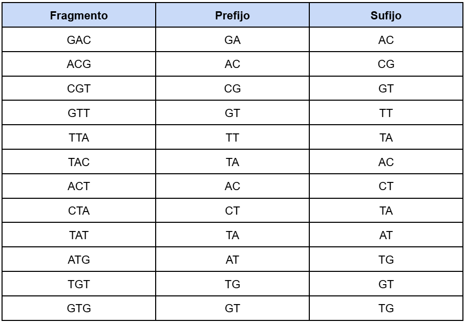

# Práctica 3 - Algoritmo de De Bruijn

En esta tarea se aborda el proceso de ensamblaje de secuencias de ADN a partir de fragmentos cortos obtenidos por secuenciación.
El objetivo es reconstruir la secuencia original utilizando la metodología basada en grafos de De Bruijn, una de las 
técnicas más empleadas en la genómica moderna para el ensamblaje de genomas.

A lo largo de la tarea se trabaja con diferentes conjuntos de fragmentos (lecturas o _reads_), representados por el alfabeto 
{A,C,G,T}, y se aplican los pasos fundamentales del método, como la generación de los k-mers, la consutrucción del grafo de
De Bruijn, y la búsqueda del camino euleriano.

El propósito de la tarea es comprender cómo los algoritmos de grafos se aplican en el contexto biológico, y cómo permiten 
transformar datos de secuenciación en una representación coherente del genoma original.

## Cuestión 1

Imagina que estás trabajando en un proyecto de investigación genómica y has recibido datos de secuenciación de ADN fragmentado.
La secuenciación te ha proporcionado una lista de lecturas cortas, cada una de longitud 4. La tarea consiste en ensamblar 
estas lecturas cortas para reconstruir la secuencia original u lizando un grafo de De Bruijn. Se partirá de los **3-mers**
de cada uno de ellos.

Los fragmentos secuenciados son:

- GACG
- CGTT
- TTAC
- ACTA
- TATG
- TGTG

### División en fragmentos, prefijos y sufijos 

**Se hará a partir de las lecturas _k-mers_ (de longitud 3) para modelar las superposiciones de las lecturas y generar el 
ensamblaje de la secuencia.**

El algoritmo de Bruijn no compara los fragmentos completos entre sí, ya que iría muy lento, así que los divide en pedazos
aún más pequeños llamados _k-mers_.

Por tanto, se comienza el ejercicio separando los fragmentos en _k-mers_ de longitud 3:

*Tabla 1. Proceso de generación de los k-mers*

Como se puede observar en la **Tabla 1**, no hay ningún _k-mer_ repetido, por lo que ahora se procede a la **división de los _k-mers_
 en prefijos y sufijos**. 

Este paso es necesario para poder llegar a construir el grafo de De Bruijn, ya que cada nodo en el grafo representa un
fragmento de longitud _k - 1_. Por tanto, en este ejercicio cada nodo representará un fragmento de longitud _3 - 1 = 2_.

*Tabla 2. Proceso de generación de los prefijos y sufijos*

En la **Tabla 2** se pueden ver los prefijos y sufijos resultantes para cada grupo de _k-mers_. Esto surge porque cada _k-mer_
crea una conexión (arista) entre dos nodos:

- El nodo de **inicio**, formado por las primeras _k - 1_ letras del _k-mer_ (prefijo)
- El nodo de **fin**, formado por las últimas _k - 1_ letras del _k-mer_ (sufijo).

### Construcción del grafo de De Bruijn

Sabiendo lo anterior, el conjunto de nodos que conformará el grafo de De Bruijn será: {GA, AC, CG, GT, TT, TA, CT, AT, TG}, y el grafo
de De Bruijn será el que se puede ver en la Figura 1:

*Figura 1. Grafo de De Bruijn*

### Camino Euleriano

Ahora que el grafo de De Bruijn está construido, se podrá comprobar si existe un camino eulariano para poder reconstruir 
la secuencia.

Un **camino euleriano** es un recorrido dentro de un grafo que **pasa exactamente una vez por cada arista**. En un grafo 
dirigido, cada nodo puede tener:

- **Grado de salida:** que correspone al número de aristas que salen del nodo (flechas)
- **Grado de entrada:** que es el número de aristas dirigidas que entran al nodo

Las condiciones que deben cumplirse para que existe un camino euleriano son:

1. **Salida:** como máximo un nodo con un grado de salida mayor en 1 al grado de entrada
2. **Entrada:** como máximo un nodo con un grado de entrada mayor en 1 al grado de salida
3. **Resto de nodos:** todos los demás nodos deben tener el mismo número de entradas y salidas
4. **Conectividad:** todos los nodos deben estar conectados

Por tanto, se pasa a comprobar si los nodos del camino cumplen con dichas condiciones para seguir un camino euleriano:

- **GA:** entrada = 0, salida = 1 → Nodo de inicio (salida = entrada + 1)
- **AC:** entrada = 2, salida = 2
- **CG:** entrada = 1, salida = 1
- **GT:** entrada = 2, salida = 2
- **TT:** entrada = 1, salida = 1
- **TA:** entrada = 2, salida = 2
- **CT:** entrada = 1, salida = 2
- **AT:** entrada = 2, salida = 2
- **TG:** entrada = 2, salida = 1 → Nodo de fin (entrada = salida + 1)

El resto de nodos están equilibrados (entrada = salida), y el grafo está conectado por las aristas relevantes.

**Camino euleriano:** GA → AC → CG → GT → TT → TA → AC → CT → TA → AT → TG → GT → TG

Por tanto, se cumple con las condiciones indicadas, así que existe un camino euleriano y se puede hacer la reconsctrucción.

### Reconstrucción

En grafos de De Bruijn, se reconstruye tomando el primer nodo y luego añadiendo la última letra de cada nodo siguiente. Por 
tanto, el resultado de la reconstrucción es **GACGTTACTATGTG**.

Para comprobar que la reconstrucción está bien, es tan sencillo como observar que todas las lecturas originales aparecen
como subcadenas de la secuencia ensamblada (Figura 2).

*Figura 2. Subcadenas de la reconstrucción*

El uso del grafo de De Bruijn ha permitido representar de manera eficiente las relaciones de superposición entre los 
fragmentos de ADN, facilitando el ensamblaje de la secuencia original. Este procedimiento ilustra cómo los algoritmos 
basados en grafos son una herramienta esencial en la bioinformática moderna, ya que permiten transformar grandes 
volúmenes de datos de secuenciación en representaciones precisas del genoma, optimizando tanto el tiempo de cómputo como
la fiabilidad del ensamblaje.

## Cuestión 2

Estás trabajando en un proyecto de inves gación genómica y enes a tu disposición fragmentos de ADN obtenidos mediante un
proceso de secuenciación de próxima generación (NGS). La tarea es ensamblar estos fragmentos y reconstruir la secuencia 
original de ADN usando un grafo de De Bruijn.

Los fragmentos secuenciados son:

- AGTC
- GTCA
- TCAG
- CAGT
- AGTT
- GTTG

Se seguirán los mismos pasos que en el ejercicio anterior:

### División en prefijos y sufijos 

Esta vez, se dividirá cada fragmento (lectura) en un prefijo de longitud _k-1=3_ y un sufijo _k-1=3_. 

El resultado es el que se puede observar en la **Tabla 3**:

*Tabla 3. Generación de los prefijos y sufijos*

### Construcción del grafo de De Bruijn

Los prefijos y sufijos el conjunto de nodos que conformará el grafo de De Bruijn será: {AGT, GTC, TCA, CAG, AGT, GTT, TTG},
y el grafo de De Bruijn será el que se puede ver en la Figura 3:

*Figura 3. Grafo de De Bruijn*

### Camino Euleriano

Con el grafo de De Brujin construido, se pasa a comprobar si existe o no un camino euleriano para reconstruir la secuencia.

Primero, se comprueba los nodos cumplen o no con las condiciones necesarias:

- **AGT:** entrada = 1, salida = 2 → Nodo de inicio (salida = entrada + 1)
- **GTC:** entrada = 1, salida = 1 
- **TCA:** entrada = 1, salida = 1
- **CAG:** entrada = 1, salida = 1
- **GTT:** entrada = 1, salida = 1
- **TTG:** entrada = 1, salida = 0 → Nodo de fin (entrada = salida + 1)

El resto de nodos están equilibrados (entrada = salida), y el grafo está conectado por las aristas relevantes.

**Camino euleriano:** AGT → GTC → TCA → CAG → AGT → GTT → TTG

Por tanto, se cumple con las condiciones indicadas, así que existe un camino euleriano y se puede hacer la reconsctrucción.

### Reconstrucción

El resultado de la reconstrucción es **AGTCAGTTG**.

Para comprobar que la reconstrucción está bien, se hace lo mismo que se hizo anteriormente en la Figura 2.

*Figura 4. Grafo de De Bruijn*

Como se ve en la **Figura 4**, todas las lecturas originales aparecen como subcadenas en la secuencia ensamblada.
